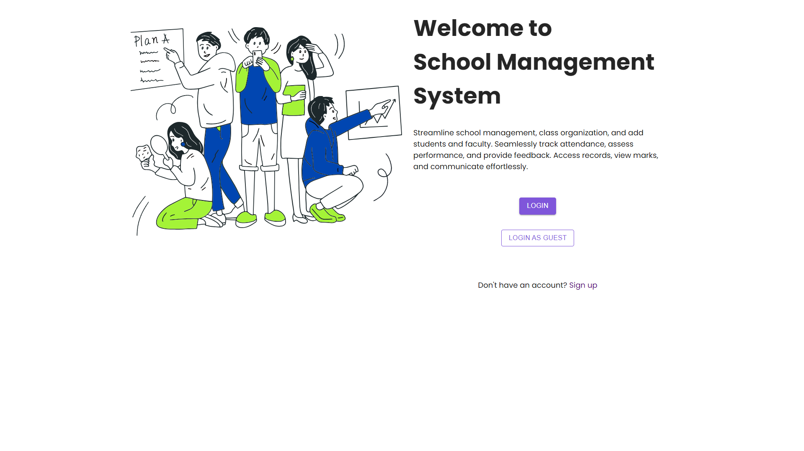

# School Management System

A full-stack MERN school management platform for handling academic operations across three role-based dashboards: Admin, Teacher, and Student. The system supports class and subject management, attendance tracking, marks management, assignments, submissions, notices, complaints, course content, and JWT-based authentication.

## Project Description

This project helps a school or campus administration manage day-to-day academic workflows from a single application.

- Admins manage the school structure and operational data.
- Teachers manage assigned classes, attendance, marks, and content.
- Students view their academic progress and submit work.

The application includes:

- secure login with JWT
- role-based access control
- ownership checks on protected operations
- Cloudinary-backed assignment and course content file uploads
- global frontend notifications and loading states
- deployment-ready environment configuration

## Tech Stack

### Frontend

- React 18
- React Router DOM
- Redux Toolkit
- Axios
- Material UI
- Styled Components
- Recharts

### Backend

- Node.js
- Express.js
- MongoDB
- Mongoose
- JWT (`jsonwebtoken`)
- Bcrypt
- Joi
- Multer
- Cloudinary
- CORS
- Dotenv

## Folder Structure

- frontend — React application
- backend — Express API and MongoDB models
- backend/config — runtime configuration such as Cloudinary setup

## Installation

### Backend install

`npm install --prefix backend`

### Frontend install

`npm install --prefix frontend`

## Running Locally

### Start backend

`cd backend && npm start`

### Start frontend

`cd frontend && npm start`

## Environment Variables

### Backend variables

Create `backend/.env` from [backend/.env.example](backend/.env.example).

| Variable                  | Required                                   | Example                                       | Description                                         |
| ------------------------- | ------------------------------------------ | --------------------------------------------- | --------------------------------------------------- |
| `NODE_ENV`                | Yes                                        | `development`                                 | Runtime mode. Use `production` in deployment.       |
| `PORT`                    | Yes                                        | `5000`                                        | Port used by the backend server.                    |
| `MONGO_URL`               | Yes                                        | `mongodb://localhost:27017/school-management` | MongoDB connection string.                          |
| `JWT_SECRET`              | Yes                                        | `replace-with-a-long-random-secret`           | Secret used to sign JWT tokens.                     |
| `JWT_EXPIRES_IN`          | Yes                                        | `7d`                                          | JWT expiration duration.                            |
| `FRONTEND_URL`            | Yes                                        | `http://localhost:3000`                       | Allowed frontend origin for CORS.                   |
| `CLOUDINARY_CLOUD_NAME`   | Yes                                        | `your-cloud-name`                             | Cloudinary cloud name used for remote file storage. |
| `CLOUDINARY_API_KEY`      | Yes                                        | `your-api-key`                                | Cloudinary API key.                                 |
| `CLOUDINARY_API_SECRET`   | Yes                                        | `your-api-secret`                             | Cloudinary API secret.                              |
| `CLOUDINARY_FOLDER`       | No                                         | `school-management-system`                    | Default Cloudinary folder for uploaded assets.      |
| `SUPER_ADMIN_NAME`        | Optional for runtime, used for seeding     | `Super Admin`                                 | Display name used by the seed script.               |
| `SUPER_ADMIN_EMAIL`       | Optional for runtime, required for seeding | `superadmin@example.com`                      | Initial admin email created by the seed script.     |
| `SUPER_ADMIN_PASSWORD`    | Optional for runtime, required for seeding | `change-this-password`                        | Initial admin password created by the seed script.  |
| `SUPER_ADMIN_SCHOOL_NAME` | Optional for runtime, required for seeding | `Main Campus`                                 | School name assigned to the initial admin.          |

### Frontend variables

Create `frontend/.env` from [frontend/.env.example](frontend/.env.example).

| Variable             | Required | Example                 | Description                         |
| -------------------- | -------- | ----------------------- | ----------------------------------- |
| `REACT_APP_BASE_URL` | Yes      | `http://localhost:5000` | Base URL for frontend API requests. |

## User Roles

### Admin

The Admin is the main school operator.

Main responsibilities:

- create the school account
- manage classes, semesters, departments, and subjects
- register and manage teachers and students
- manage notices, complaints, quizzes, fee vouchers, and timetables
- oversee academic records and operational workflows

### Teacher

The Teacher manages academic delivery for assigned classes and subjects.

Main responsibilities:

- view assigned class students
- record attendance
- update marks
- upload and manage course content
- review assignment submissions
- monitor progress in the assigned subject

### Student

The Student uses the platform to track academic progress.

Main responsibilities:

- log in and view personal academic data
- check attendance and marks
- read notices
- submit assignments
- access course content and schedules

## Authentication and Security

The project uses:

- hashed passwords with Bcrypt
- JWT authentication
- role-based route protection
- ownership checks for sensitive records
- request validation with Joi
- centralized backend error handling

## System Architecture

The application follows a role-aware MERN architecture where the React frontend consumes an Express API backed by MongoDB. Business rules are enforced on the server side, while the client focuses on authenticated user experience, role-based navigation, and real-time updates.

### Security Architecture

#### JWT authentication

- Users authenticate through role-specific login flows.
- The backend signs access tokens with `JWT_SECRET` and returns them to the frontend.
- The frontend stores the authenticated session and attaches the token to every API request through a centralized Axios interceptor.
- Protected routes are guarded by `authMiddleware`, which validates the Bearer token and restores the authenticated identity on `req.user`.

#### Role-based authorization

- `checkRole()` restricts endpoints to the correct actor, such as `Admin`, `Teacher`, or `Student`.
- This ensures privileged operations like user creation, class administration, grading, and notices remain unavailable to unauthorized roles.

#### IDOR protection

One of the most important security improvements was preventing insecure direct object references.

- The `isOwnerOrAdmin()` middleware verifies that a user can only access their own resource unless they are an `Admin`.
- This prevents a student from changing a URL parameter and reading or modifying another student's protected records.
- Ownership checks are applied to high-risk endpoints such as student profile access and self-service updates.

#### Validation and safe field handling

- Joi schemas validate critical request payloads before controller logic runs.
- Controllers use field whitelisting helpers such as `pickAllowedFields()` so that untrusted clients cannot mass-assign sensitive properties.
- Together, validation plus field whitelisting reduce injection risk, privilege escalation risk, and malformed write operations.

### Data Integrity Architecture

MongoDB gives flexibility, but the application still needs strong consistency rules. We implemented that consistency through targeted Mongoose middleware.

#### Cascade-safe deletion with Mongoose hooks

- [backend/models/sclassSchema.js](backend/models/sclassSchema.js) uses a `pre("findOneAndDelete")` hook to cascade subject cleanup when a class is removed and to detach students from the deleted class.
- [backend/models/subjectSchema.js](backend/models/subjectSchema.js) uses a `pre("findOneAndDelete")` hook to remove dependent assignments and course content, unset teacher subject mappings, and pull related exam and attendance references from students.
- [backend/models/assignmentSchema.js](backend/models/assignmentSchema.js) cascades deletion into assignment submissions before removing the parent assignment.

#### File lifecycle integrity

- [backend/models/courseContentSchema.js](backend/models/courseContentSchema.js) and [backend/models/assignmentSubmissionSchema.js](backend/models/assignmentSubmissionSchema.js) clean up Cloudinary assets before records are deleted.
- This avoids orphaned remote files, dangling URLs, and storage leaks.
- The helper in [backend/utils/cloudinaryFile.js](backend/utils/cloudinaryFile.js) resolves Cloudinary public IDs safely even when only a URL is available.

#### Why hooks matter here

Without these hooks, the system could accumulate stale submissions, orphaned content, invalid attendance references, or remote assets that no longer belong to any academic record. By pushing cleanup into model-level middleware, integrity stays close to the data layer instead of depending on every controller to remember every cleanup step.

## Technical Challenges & Solutions

### 1. Migrating from local uploads to Cloudinary

#### Challenge

The original local-file approach was harder to scale and unsuitable for production hosting platforms where local storage is ephemeral. It also made deletion consistency difficult, especially when assignments, submissions, and content were removed through cascading workflows.

#### Solution

- We replaced local storage with Cloudinary-backed upload handling.
- Upload metadata such as `fileUrl`, `filePublicId`, and `fileResourceType` is stored in MongoDB alongside each business record.
- [backend/config/cloudinary.js](backend/config/cloudinary.js) reads all required Cloudinary environment variables and fails fast if configuration is incomplete.
- [backend/utils/cloudinaryFile.js](backend/utils/cloudinaryFile.js) centralizes remote deletion logic and supports multiple resource types.
- Model-level deletion hooks ensure Cloudinary files are cleaned up whenever records are deleted directly or through cascades.

#### Result

The platform is now deployment-friendly, storage is centralized, and file cleanup is consistent across assignment, submission, and course content workflows.

### 2. Adding real-time notices with Socket.IO

#### Challenge

The system needed instant notice delivery so users could see new school announcements without refreshing the dashboard. The difficulty was adding real-time behavior without tightly coupling event logic across the entire backend.

#### Solution

- A dedicated Socket.IO bootstrap layer was added in [backend/socket.js](backend/socket.js).
- The backend server initializes Socket.IO once and exposes `getIO()` so controllers can emit events without reconfiguring socket state.
- [backend/controllers/notice-controller.js](backend/controllers/notice-controller.js) emits a `new_notice` event immediately after a notice is created.
- On the frontend, [frontend/src/hooks/useSocket.js](frontend/src/hooks/useSocket.js) encapsulates socket subscription logic into a reusable hook.
- [frontend/src/App.js](frontend/src/App.js) listens globally and triggers a shared notification experience.

#### Result

The notice system now behaves like a real-time collaboration feature while keeping the implementation modular, testable, and easy to extend to future live features such as chat, attendance alerts, or live class announcements.

## Future Roadmap

The current platform is production-oriented, but several high-impact features can extend it further:

- **Live video classes** via Zoom API or Google Meet integration for remote teaching workflows.
- **Online fee payments** via Stripe to let students pay vouchers securely inside the platform.
- **Parent/guardian portal** for attendance monitoring, fee visibility, and academic alerts.
- **Advanced analytics** for trend dashboards, at-risk students, and department-level academic reporting.
- **Notification center** with email, in-app, and push notifications for notices, assignment deadlines, and fee reminders.
- **Audit trails** for sensitive administrative actions such as grading changes, voucher updates, and role changes.
- **Multi-school tenancy refinement** for district-scale deployments.
- **Offline-first attendance capture** for teachers working with unstable connectivity.
- **Calendar integration** for classes, exams, and assignment deadlines.
- **Expanded automated testing** with more controller, integration, and end-to-end coverage.

## Initial Super Admin Seeding

Because hardcoded credentials were removed, create the first Admin account with the seed script.

### Step 1: add seed values to `backend/.env`

Set these values in your backend environment:

- `SUPER_ADMIN_NAME`
- `SUPER_ADMIN_EMAIL`
- `SUPER_ADMIN_PASSWORD`
- `SUPER_ADMIN_SCHOOL_NAME`

### Step 2: run the seed command

`cd backend && npm run seed:admin`

### What the script does

The seed script in [backend/scripts/seedSuperAdmin.js](backend/scripts/seedSuperAdmin.js):

- loads `backend/.env`
- connects to MongoDB using `MONGO_URL`
- checks whether an admin already exists with the same email or school name
- creates the initial Admin account if none exists
- hashes the password before saving

### Notes

- The script is safe to re-run and will not create a duplicate admin with the same email or school name.
- The seeded account uses role `Admin`, which is the top-level administrative role in this project.
- After seeding, log in through the Admin login page and continue setup from the UI.

## Build and Deployment Notes

- In production, the backend can serve the frontend build when `NODE_ENV=production`.
- Uploaded files are stored in Cloudinary and the database stores Cloudinary URLs plus asset metadata.
- Deleting assignments, course content, and assignment submissions also removes their Cloudinary assets.
- Make sure `FRONTEND_URL` and `REACT_APP_BASE_URL` match your deployment setup.

## Useful Commands

### Install both apps

`npm install --prefix backend && npm install --prefix frontend`

### Start backend and frontend separately

`cd backend && npm start`

`cd frontend && npm start`

### Build frontend

`cd frontend && npm run build`

### Seed initial admin

`cd backend && npm run seed:admin`

### Generate developer guide

`cd backend && npm run docs:devguide`

## Feature Summary

Core modules included in the project:

- authentication
- admin management
- teacher management
- student management
- class and subject management
- attendance and marks
- assignments and submissions
- course content uploads
- notices and complaints
- quizzes and fee vouchers
- timetable management

## License

This project is distributed under the license in [LICENSE](LICENSE).
